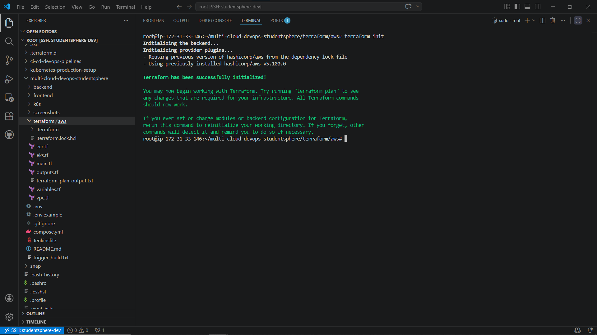
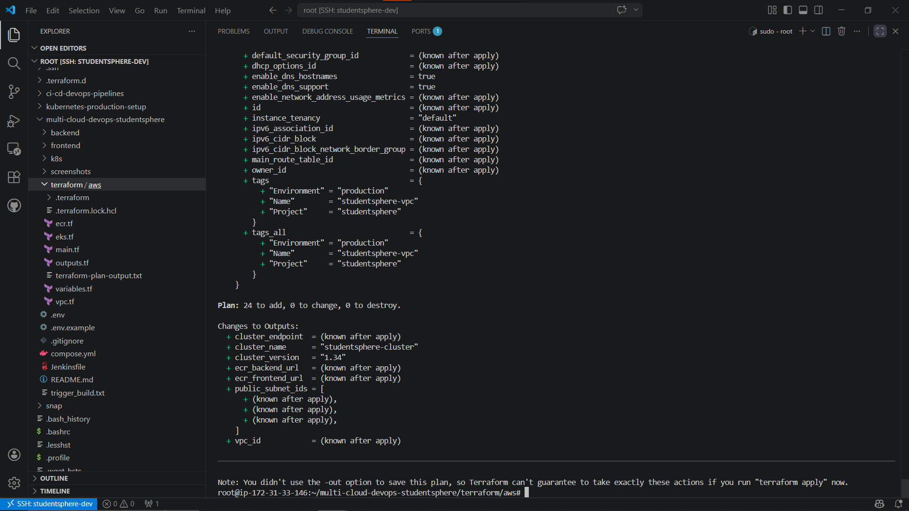
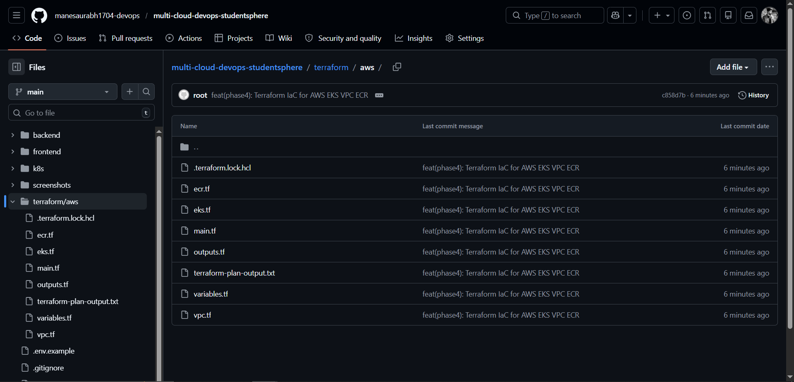

# 🏗️ Terraform Multi-Cloud Infrastructure

> Production-grade Terraform IaC for StudentSphere application.
> Provisions AWS EKS, VPC, ECR — Azure AKS and GCP GKE in Phase 9.
> Part of the [multi-cloud-devops-studentsphere](https://github.com/manesaurabh1704-devops/multi-cloud-devops-studentsphere) project.

---

## 📁 Repository Structure

```
terraform-multi-cloud-infra/
├── aws/                        # AWS Infrastructure (Phase 4) ✅
│   ├── main.tf                 # AWS provider + Terraform version config
│   ├── variables.tf            # All configurable variables
│   ├── vpc.tf                  # VPC, Subnets, IGW, Route Tables
│   ├── eks.tf                  # EKS Cluster, Node Group, IAM Roles
│   ├── ecr.tf                  # ECR Repositories + Lifecycle Policies
│   └── outputs.tf              # Output values — cluster URL, VPC ID, ECR URLs
├── azure/                      # Azure Infrastructure (Phase 9) ✅
│   └── README.md               # AKS + VNet
├── gcp/                        # GCP Infrastructure (Phase 9) ✅
│   └── README.md               # GKE + VPC
├── screenshots/                # Proof of terraform plan
└── README.md
```

---

## 🔄 Why Terraform / Why IaC?

```
Without Terraform (Manual):
  eksctl create cluster ...    (not reproducible — different every time)
  Manual VPC setup             (error-prone + no version control)
  No audit trail               (who changed what, when?)

With Terraform (IaC):
  terraform apply              (entire infra in 15 minutes — repeatable)
  Version controlled infra     (review changes like code — PR + approval)
  Same code for all clouds     (AWS → Azure → GCP with minimal changes)
  terraform destroy            (clean teardown — no orphaned resources)
  terraform plan               (preview changes before applying — safe)
```

---

## ☁️ Cloud Coverage

| Cloud | Service | Status |
|---|---|---|
| AWS | EKS + VPC + ECR | ✅ Phase 4 Complete |
| Azure | AKS + VNet | ✅ Phase 9 Complete |
| GCP | GKE + VPC | ✅ Phase 9 Complete |

---

## 🏗️ AWS Infrastructure Architecture

```
AWS Region: ap-south-1
    │
    ├── VPC (192.168.0.0/16)
    │   ├── Public Subnets  (x3) — EKS Nodes + LoadBalancer
    │   ├── Private Subnets (x3) — Future use
    │   ├── Internet Gateway
    │   └── Route Tables
    │
    ├── EKS Cluster (studentsphere-cluster)
    │   ├── Kubernetes v1.34
    │   ├── Node Group (t3.small x2)
    │   └── IAM Roles + Policies
    │
    └── ECR Repositories
        ├── studentsphere-backend
        └── studentsphere-frontend
```

---

## 📋 AWS Resources Created (24 total)

| Resource | Type | Description |
|---|---|---|
| aws_vpc | VPC | Main VPC with DNS enabled |
| aws_subnet (public) | Subnet x3 | Public subnets across 3 AZs |
| aws_subnet (private) | Subnet x3 | Private subnets across 3 AZs |
| aws_internet_gateway | IGW | Internet access for public subnets |
| aws_route_table | Route Table | Public traffic routing |
| aws_eks_cluster | EKS | Managed Kubernetes cluster |
| aws_eks_node_group | Node Group | t3.small worker nodes |
| aws_iam_role (cluster) | IAM Role | EKS cluster permissions |
| aws_iam_role (nodes) | IAM Role | EKS node permissions |
| aws_ecr_repository | ECR x2 | Backend + Frontend image repos |
| aws_ecr_lifecycle_policy | Policy x2 | Keep last 10 images |

---

## ⚡ How to Use

### Prerequisites

```bash
# Install Terraform
sudo apt install -y gnupg software-properties-common
wget -O- https://apt.releases.hashicorp.com/gpg | \
  sudo gpg --dearmor -o /usr/share/keyrings/hashicorp-archive-keyring.gpg
echo "deb [signed-by=/usr/share/keyrings/hashicorp-archive-keyring.gpg] \
  https://apt.releases.hashicorp.com $(lsb_release -cs) main" | \
  sudo tee /etc/apt/sources.list.d/hashicorp.list
sudo apt update && sudo apt install -y terraform

# Verify
terraform --version
```

Expected output:
```
Terraform v1.14.8
on linux_amd64
```

```bash
# Configure AWS CLI
aws configure
```

```
AWS Access Key ID:     YOUR_ACCESS_KEY
AWS Secret Access Key: YOUR_SECRET_KEY
Default region name:   ap-south-1
Default output format: json
```

---

### Step 1 — Clone Repository

```bash
git clone https://github.com/manesaurabh1704-devops/terraform-multi-cloud-infra.git
cd terraform-multi-cloud-infra/aws
```

---

### Step 2 — Terraform Init

```bash
terraform init
```

Expected output:
```
Initializing the backend...
Initializing provider plugins...
- Finding hashicorp/aws versions matching "~> 5.0"...
- Installing hashicorp/aws v5.100.0...
- Installed hashicorp/aws v5.100.0 (signed by HashiCorp)

Terraform has been successfully initialized!
```

---

### Step 3 — Terraform Plan

```bash
terraform plan
```

Expected output:
```
Plan: 24 to add, 0 to change, 0 to destroy.

Changes to Outputs:
  + cluster_endpoint  = (known after apply)
  + cluster_name      = "studentsphere-cluster"
  + cluster_version   = "1.34"
  + ecr_backend_url   = (known after apply)
  + ecr_frontend_url  = (known after apply)
  + public_subnet_ids = (known after apply)
  + vpc_id            = (known after apply)
```

---

### Step 4 — Terraform Apply

```bash
terraform apply -auto-approve
```

Expected output:
```
aws_vpc.main: Creating...
aws_vpc.main: Creation complete after 2s
...
aws_eks_cluster.main: Creating...
aws_eks_cluster.main: Creation complete after 12m
aws_eks_node_group.main: Creating...
aws_eks_node_group.main: Creation complete after 2m

Apply complete! Resources: 24 added, 0 changed, 0 destroyed.

Outputs:
cluster_endpoint  = "https://XXXX.gr7.ap-south-1.eks.amazonaws.com"
cluster_name      = "studentsphere-cluster"
cluster_version   = "1.34"
ecr_backend_url   = "207457247776.dkr.ecr.ap-south-1.amazonaws.com/studentsphere-backend"
ecr_frontend_url  = "207457247776.dkr.ecr.ap-south-1.amazonaws.com/studentsphere-frontend"
vpc_id            = "vpc-XXXXXXXXXXXXXXXXX"
```

---

### Step 5 — Configure kubectl

```bash
aws eks update-kubeconfig \
  --region ap-south-1 \
  --name studentsphere-cluster

# Verify
kubectl get nodes
```

Expected output:
```
NAME                                            STATUS   ROLES    AGE
ip-192-168-62-10.ap-south-1.compute.internal    Ready    <none>   5m
ip-192-168-86-169.ap-south-1.compute.internal   Ready    <none>   5m
```

---

### Step 6 — Destroy (To Save Cost)

```bash
terraform destroy -auto-approve
```

Expected output:
```
Destroy complete! Resources: 24 destroyed.
```

---

## 🔧 Customization — variables.tf

```hcl
# Change region
variable "aws_region" {
  default = "us-east-1"    # Change to your preferred region
}

# Change instance type
variable "node_instance_type" {
  default = "t3.medium"    # Upgrade for more resources
}

# Change node count
variable "node_desired_size" {
  default = 3              # Scale up for production
}
```

---

## 📸 Output / Proof

### Terraform Init


### Terraform Plan — 24 Resources


### GitHub — All Terraform Files


---

## 🐛 Troubleshooting

### Problem 1 — AWS Credentials Not Found
```
Error: No valid credential sources found

Fix:
aws configure
# Enter your Access Key, Secret Key, Region
```

### Problem 2 — EKS Node Launch Failed
```
Error: InvalidParameterCombination - instance type not eligible

Fix: Use t3.small instead of t3.medium for new accounts
variable "node_instance_type" {
  default = "t3.small"
}
```

### Problem 3 — Terraform State Conflict
```
Error: resource already exists

Fix: Import existing resource
terraform import aws_eks_cluster.main studentsphere-cluster
```

### Problem 4 — Provider Version Conflict
```
Error: provider registry.terraform.io/hashicorp/aws: no available releases

Fix:
terraform init -upgrade
```

### Problem 5 — Cannot Scale Node Group
```
Error: desired capacity can't be greater than max size

Fix: Increase max size first
eksctl scale nodegroup \
  --cluster studentsphere-cluster \
  --name studentsphere-nodes \
  --nodes 4 \
  --nodes-max 5 \
  --region ap-south-1
```

---

## 🔗 Related Repositories

| Repository | Purpose |
|---|---|
| [multi-cloud-devops-studentsphere](https://github.com/manesaurabh1704-devops/multi-cloud-devops-studentsphere) | Main project — Full DevOps system |
| [kubernetes-production-setup](https://github.com/manesaurabh1704-devops/kubernetes-production-setup) | Kubernetes manifests |
| [ci-cd-devops-pipelines](https://github.com/manesaurabh1704-devops/ci-cd-devops-pipelines) | Jenkins CI/CD pipelines |
| [monitoring-observability-stack](https://github.com/manesaurabh1704-devops/monitoring-observability-stack) | Prometheus + Grafana |
| [devops-security-secrets](https://github.com/manesaurabh1704-devops/devops-security-secrets) | RBAC + Security |

---

## 👨‍💻 Author
**Saurabh Mane** — DevOps Engineer
- GitHub: [@manesaurabh1704-devops](https://github.com/manesaurabh1704-devops)

---

> ⭐ Star this repo if you find it helpful!
